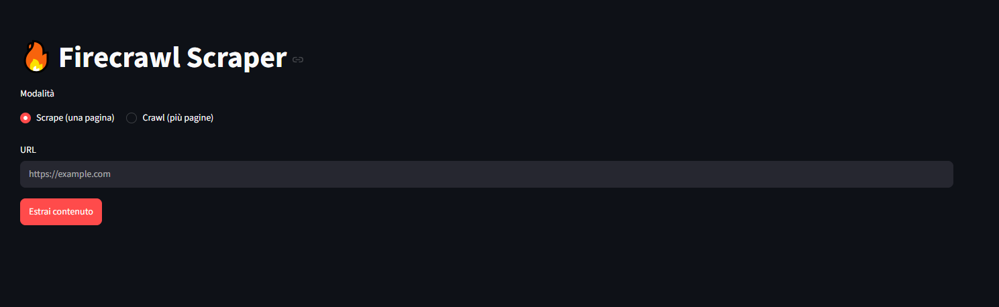
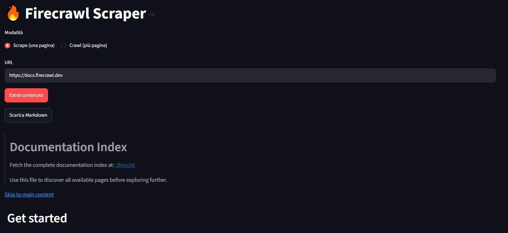
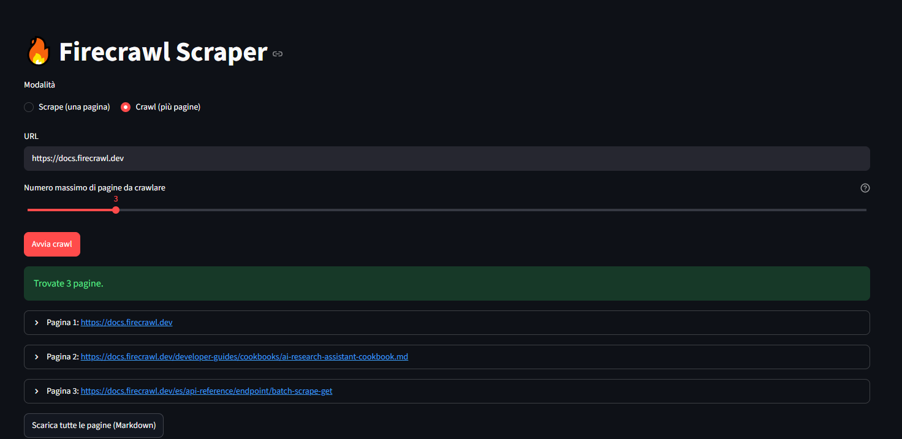

# Firecrawl Streamlit Scraper

[](https://www.python.org/)
[](https://streamlit.io/)
[](https://www.firecrawl.dev/)
[](https://github.com/ectorr01/firecrawl-streamlit)

[](https://github.com/ectorr01/firecrawl-streamlit/commits/main)
[](https://github.com/ectorr01/firecrawl-streamlit)

## Descrizione del progetto

## Screenshot

### Home Page




### Modalità Scrape



### Modalità Crawl



**Firecrawl Streamlit Scraper** è un'applicazione web che permette di estrarre in modo rapido e ordinato il contenuto di pagine web pubbliche, trasformandolo in Markdown pulito e leggibile. L'app supporta due modalità di utilizzo: l'estrazione di una singola pagina oppure il crawling automatico di più pagine appartenenti allo stesso sito.

Il progetto nasce per semplificare un problema comune a chi lavora con l'intelligenza artificiale e l'analisi dati: recuperare il contenuto "utile" di una o più pagine web senza dover gestire manualmente parsing HTML, script dinamici, elementi grafici superflui, paginazione o navigazione tra i link di un sito.

L'app si appoggia all'**API di Firecrawl**, un servizio specializzato nella conversione di pagine web in dati pronti per essere utilizzati da modelli linguistici (LLM), pipeline RAG, agenti AI o semplici analisi testuali. Il livello di interfaccia è invece gestito da **Streamlit**, che consente di ottenere un'applicazione interattiva e immediata senza dover costruire un frontend da zero.

### Le due modalità disponibili

- **Scrape (una pagina)**: converte una singola pagina web in Markdown, restituendo anche i metadati disponibili (titolo, descrizione, lingua). È il punto di partenza ideale per capire come Firecrawl elabora un contenuto.
- **Crawl (più pagine)**: parte da un URL e segue automaticamente i link interni del sito, restituendo il Markdown di più pagine in un'unica esecuzione. È utile quando serve raccogliere contenuti da un'intera sezione di documentazione, un blog o un sito informativo. Il numero massimo di pagine è configurabile direttamente dall'interfaccia, per tenere sotto controllo il consumo di crediti Firecrawl.

### A cosa serve concretamente

- Raccogliere in modo veloce il testo di articoli, documentazioni o pagine informative.
- Estrarre in blocco più pagine collegate di uno stesso sito, senza scriverne manualmente il crawler.
- Preparare contenuti web puliti da usare come contesto per chatbot basati su LLM.
- Effettuare piccoli esperimenti di web scraping senza scrivere parser HTML personalizzati.
- Testare in autonomia come Firecrawl elabora e struttura pagine singole o interi siti.
- Avere un punto di partenza riutilizzabile per progetti più ampi di ricerca automatica sul web.

### Come funziona in breve

1. L'utente seleziona la modalità **Scrape** o **Crawl** e inserisce l'URL di partenza tramite l'interfaccia Streamlit.
2. In modalità Crawl, l'utente imposta anche il numero massimo di pagine da recuperare.
3. L'applicazione invia la richiesta all'API di Firecrawl tramite l'SDK Python ufficiale.
4. Firecrawl analizza la pagina (o le pagine collegate), rimuove il contenuto superfluo e restituisce il testo in formato Markdown.
5. Il risultato viene mostrato direttamente nell'app: come blocco unico in modalità Scrape, oppure come elenco espandibile di pagine in modalità Crawl.
6. È possibile scaricare il contenuto ottenuto come file `.md`, singolo o combinato.

### A chi è utile

Il progetto è pensato principalmente per scopi didattici e di prototipazione: è un esempio pratico di integrazione tra un servizio di scraping basato su AI e un'interfaccia utente realizzata in Python, utile a chi sta imparando a costruire applicazioni Streamlit oppure a chi vuole capire concretamente come alimentare un chatbot o un sistema RAG con dati provenienti dal web, sia da singole pagine sia da interi siti.

## Funzionalità

- Inserimento di un URL tramite interfaccia web.
- Modalità **Scrape**: estrazione del contenuto di una singola pagina.
- Modalità **Crawl**: estrazione automatica di più pagine collegate allo stesso sito, con limite configurabile.
- Conversione del contenuto in Markdown.
- Visualizzazione dei metadati disponibili in modalità Scrape.
- Elenco espandibile dei risultati per ogni pagina trovata in modalità Crawl.
- Download del risultato come file `.md`, singolo o combinato.
- Gestione degli errori e validazione dell'URL.

## Requisiti

- Python 3.10 o superiore.
- Un account Firecrawl.
- Una Firecrawl API key.

## Installazione locale

Clona il repository e raggiungi la cartella del progetto:

```bash
git clone https://github.com/ectorr01/firecrawl-streamlit.git
cd firecrawl-streamlit
```

Crea e attiva un ambiente virtuale:

### Windows PowerShell

```powershell
python -m venv .venv
.venv\Scripts\Activate.ps1
```

### macOS/Linux

```bash
python3 -m venv .venv
source .venv/bin/activate
```

Installa le dipendenze:

```bash
pip install -r requirements.txt
```

## Configurazione della API key

Crea il file:

```text
.streamlit/secrets.toml
```

Inserisci al suo interno:

```toml
FIRECRAWL_API_KEY = "fc-la-tua-api-key"
```

Non pubblicare mai questo file su GitHub. Assicurati che `.gitignore` contenga:

```gitignore
.streamlit/secrets.toml
.venv/
__pycache__/
```

## Avvio dell'applicazione

Esegui:

```bash
streamlit run app.py
```

Apri quindi l'indirizzo mostrato nel terminale, normalmente:

```text
http://localhost:8501
```

## Utilizzo

1. Seleziona la modalità **Scrape (una pagina)** oppure **Crawl (più pagine)**.
2. Inserisci l'URL della pagina o del sito da analizzare.
3. In modalità Crawl, imposta il numero massimo di pagine (parti con un valore basso, ad esempio 3-5, per tenere sotto controllo i crediti Firecrawl utilizzati).
4. Avvia l'estrazione con il bottone corrispondente.
5. Consulta il risultato direttamente nell'app oppure scaricalo come file Markdown.

## Struttura del progetto

```text
firecrawl-streamlit/
├── app.py
├── requirements.txt
├── README.md
├── .gitignore
└── .streamlit/
    └── secrets.toml
```

Il file `secrets.toml` deve rimanere solo in locale e non deve essere incluso nel repository.

## Deploy su Streamlit Community Cloud

1. Accedi a Streamlit Community Cloud.
2. Seleziona **Create app**.
3. Scegli il repository GitHub.
4. Seleziona il branch `main`.
5. Indica `app.py` come file principale.
6. Apri le impostazioni avanzate e inserisci nei Secrets:

```toml
FIRECRAWL_API_KEY = "fc-la-tua-api-key"
```

7. Avvia il deploy.

Non caricare `secrets.toml` nel repository: la API key deve essere configurata nei Secrets di Streamlit Community Cloud.

## Note di sicurezza

- Non condividere la Firecrawl API key.
- Non inserirla direttamente nel codice Python.
- Non committare `.streamlit/secrets.toml`.
- Se la chiave viene pubblicata per errore, revocala dal dashboard Firecrawl e generane una nuova.
- In modalità Crawl, ogni pagina recuperata consuma credito Firecrawl: imposta sempre un limite ragionevole.

## Licenza

Aggiungi una licenza al repository se intendi distribuire pubblicamente il progetto. Per un progetto personale puoi scegliere, ad esempio, MIT; verifica comunque che sia adatta al tuo caso d'uso.
